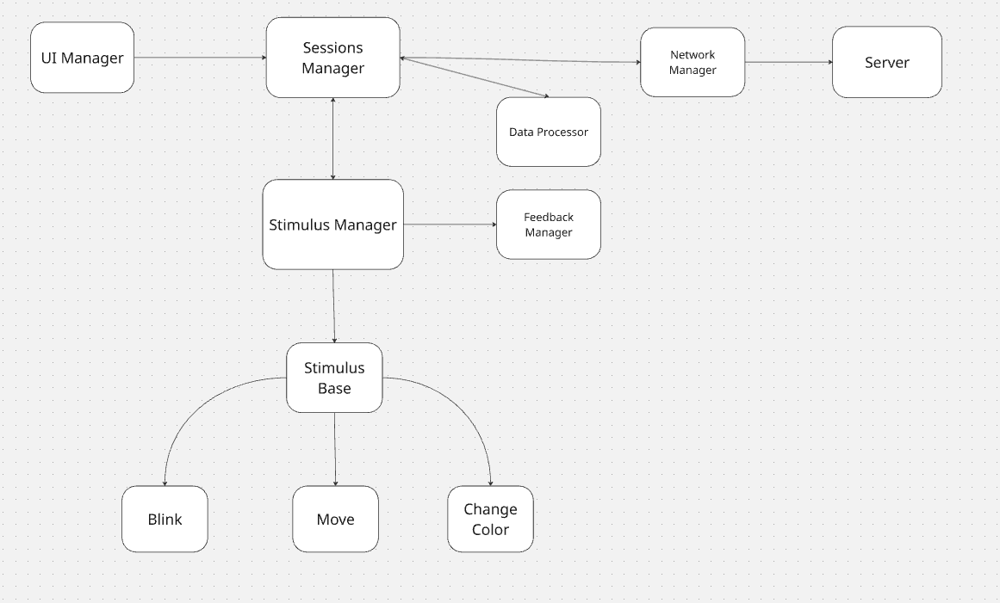

## 🧩 Setup & Run Instructions

- **Unity Version:** 6000.0.23f1
- **No external packages required.**
- Works out of the box using built-in Unity components.

### How to Run
1. Open the project in Unity.
2. Load the `Main` scene from the Project window.
3. Press **Play** in the Editor.
4. React to stimuli using:
   - **Spacebar** → Keyboard input  
   - **Left Mouse Click** → Mouse input  
5. After several trials, a JSON summary is logged to the Console.

## 📊 Example JSON Output

### 🔹 Event Log
Example of JSON containing individual reaction events collected during a session:

```json
{
  "Items": [
    {
      "sessionId": "mmx-20251018-163702-7338",
      "trialIndex": 0,
      "stimulusType": "Blinking",
      "stimulusOnSinceStartup": 8.028169402719869,
      "responded": false,
      "responseType": "",
      "hit": false
    },
    {
      "sessionId": "mmx-20251018-163702-7338",
      "trialIndex": 1,
      "stimulusType": "Movement",
      "stimulusOnSinceStartup": 12.072836302721044,
      "responded": true,
      "responseType": "key",
      "hit": true
    },
    {
      "sessionId": "mmx-20251018-163702-7338",
      "trialIndex": 2,
      "stimulusType": "ColorChange",
      "stimulusOnSinceStartup": 14.041201702721083,
      "responded": true,
      "responseType": "key",
      "hit": true
    }
  ]
}

```

### 🔹 Session Summary
Example of the aggregated session summary generated after all trials are completed:

```json
{
  "sessionId": "mmx-20251018-163702-7338",
  "timestamp": "2025-10-18T16:37:11.8158042+00:00",
  "stimuliCount": 3,
  "hits": 2,
  "hitAccuracy": 0.6666666666666666,
  "averageReactionTime": 228
}

```

## 🧠 Data Flow and Design Choices

### Data Flow
1. **User starts the session**  
   - The user presses the **Start** button to begin the reaction training sequence.

2. **Session initialization**  
   - The `SessionManager` activates the `StimulusManager` and prepares session metadata (e.g., session ID, timestamps).

3. **Stimulus execution**  
   - The `StimulusManager` runs a sequence of four trials per session.  
   - For each trial, it randomly selects one stimulus type from the available list (Movement, Blink, or Color Change) and presents it. 
   - For each trial, it measures reaction time, records response details, and stores a `ReactionEvent` in an internal list.

4. **Data collection**  
   - After completing all trials, the `StimulusManager` sends the collected list of reaction events back to the `SessionManager`.

5. **Summary generation**  
   - The `SessionManager` uses the `DataSummary` class to aggregate results — computing total stimuli, hit count, hit accuracy, and average reaction time.

6. **Network transmission**  
   - The `SessionManager` passes the summary and event list to the `NetworkManager`, which formats the data as JSON and sends it to the backend API endpoint.


### Design Choices

- **High Timing Precision**  
  - Uses `Time.realtimeSinceStartupAsDouble` instead of `Time.time` to provide frame-rate–independent timing and accurate millisecond reaction measurements.

- **Maintainability & Scalability**  
  - New stimulus types can be added easily by subclassing `StimulusBase`.  
  - The data model (`ReactionEvent` and `DataSummary`) maps directly to JSON structures used for backend ingestion.  
  - The architecture is modular, allowing individual systems (UI, feedback, network) to evolve or be replaced without impacting the core gameplay logic.

- **Clean Separation of Concerns**  
  - `StimulusBase` defines a common interface for all stimulus types (e.g., visual, movement), making the system easy to extend.  
  - `SessionManager` acts as the central controller, coordinating communication between all subsystems.  
  - `UIManager` handles all user interface elements and on-screen information.  
  - `FeedbackManager` manages auditory and visual feedback (sounds, particles).  
  - `DataSummary` processes the collected event list to calculate statistics such as average reaction time and accuracy.  
  - `NetworkManager` handles data transmission to the backend server.  
  - Most components communicate via **Unity events**, ensuring loose coupling and eliminating direct dependencies between classes.




